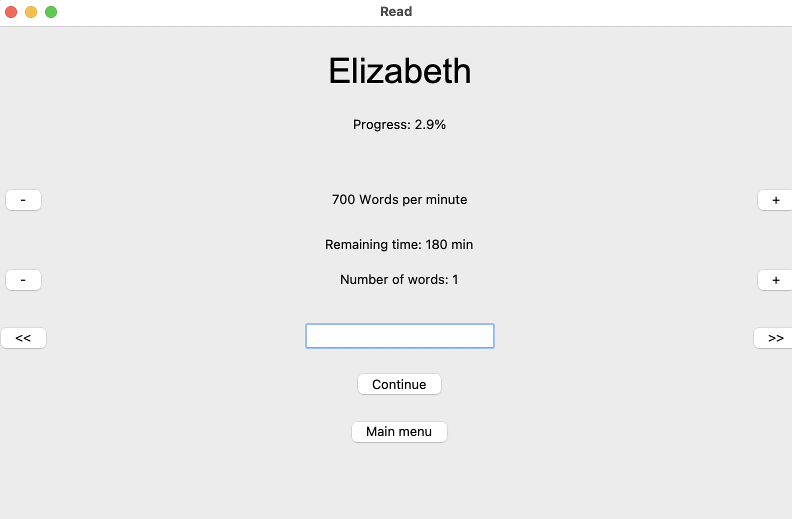

# SpeedReader Project

Welcome to the SpeedReader Project repository! This innovative software tool is designed to enhance your reading efficiency by presenting EPUB files in a rapid serial visual presentation (RSVP) format. By displaying words individually at a controlled speed, SpeedReader allows users to read faster and more comfortably without the need for eye movement across traditional lines of text.

## Key Features

### **Static Word Display for Increased Speed and Comprehension**

One of the core features of SpeedReader is its ability to display single words in a fixed position on the screen. Research suggests that a significant amount of reading time is consumed by the physical movement of the eyes from word to word and line to line. By eliminating these movements, SpeedReader minimizes the reader's visual effort and allows for quicker processing of text. This static display method not only increases reading speeds but also potentially enhances comprehension by reducing cognitive load.

### **Dynamic Speed Control**

Understanding that every reader has their own comfort level and reading capability, SpeedReader offers dynamic speed control. This feature allows users to adjust the speed at which words are displayed in real time. Whether you're looking to breeze through a novel or spend a little extra time on denser material, SpeedReader makes it easy to change speeds on the fly without interrupting the reading experience.

### **Predictive Time Remaining Estimation**

Another innovative aspect of SpeedReader is its ability to predict the remaining reading time for any given EPUB file. The software analyzes the total word count and adapts to the individual’s reading speed settings to provide an accurate estimate of how long it will take to complete the book. This feature is particularly useful for planning reading sessions and managing time more efficiently, especially for students and professionals who need to read within tight schedules.

## Installation

To get started with SpeedReader, follow these steps in your terminal:

```bash
# Clone the repository
git clone https://github.com/anton325/speedreader.git

# Navigate to the project directory
cd speedreader

# Install the required Python packages
pip install -r requirements.txt
```
## Usage

To use SpeedReader, simply load your EPUB file through the user interface, and adjust the speed using the provided controls. The software will display words one at a time at your chosen speed.

## Screenshots

### Main Menu


### Reading Screen


## Contributing

Contributions are welcome! Please feel free to fork the repository, make changes, and submit a pull request.

## License

This project is licensed under the MIT License - see the LICENSE file for details.

I hope you enjoy using SpeedReader as much as I enjoyed creating it. Happy reading!